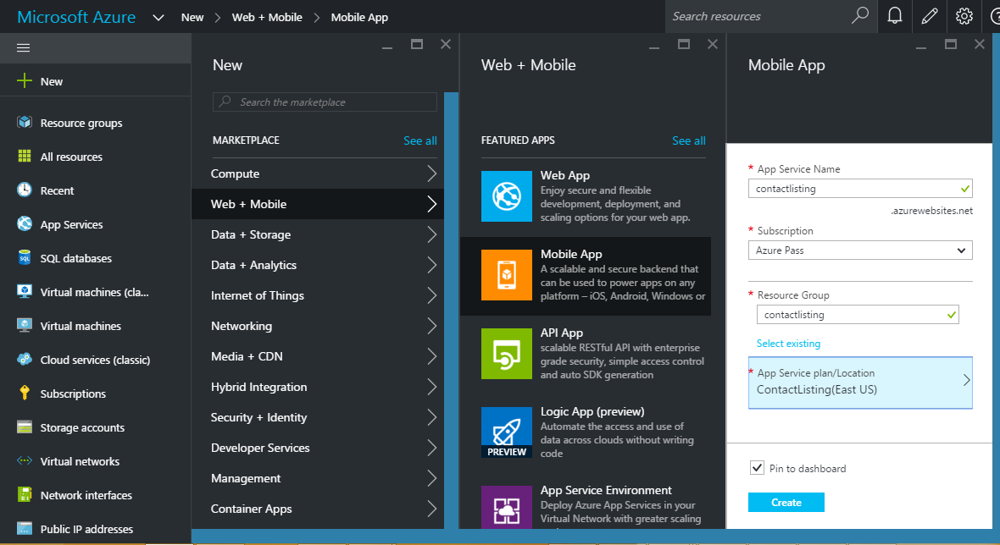
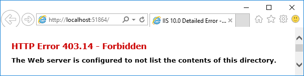
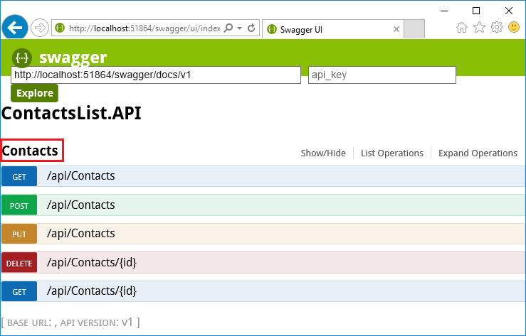
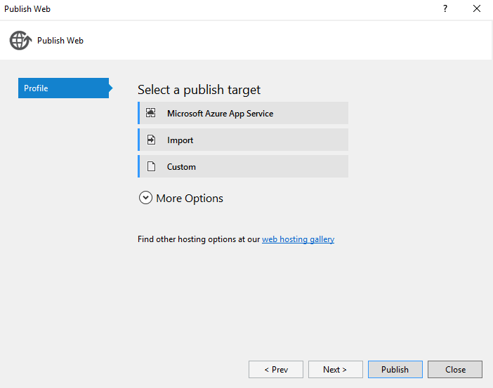
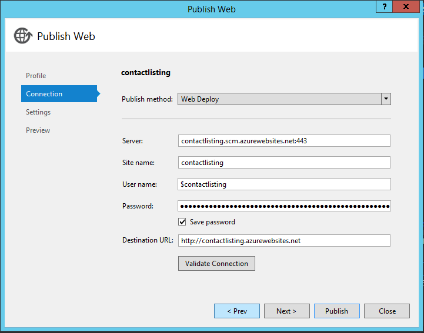
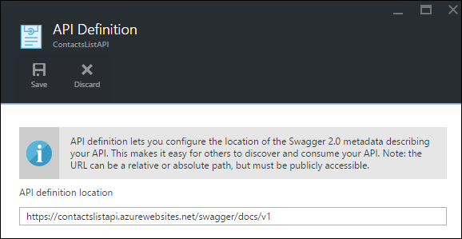
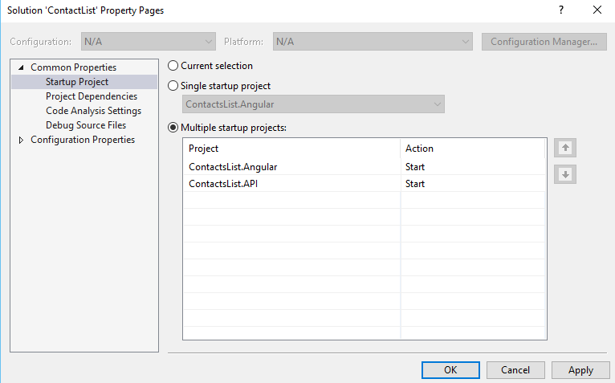
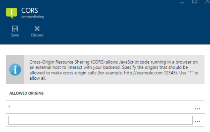
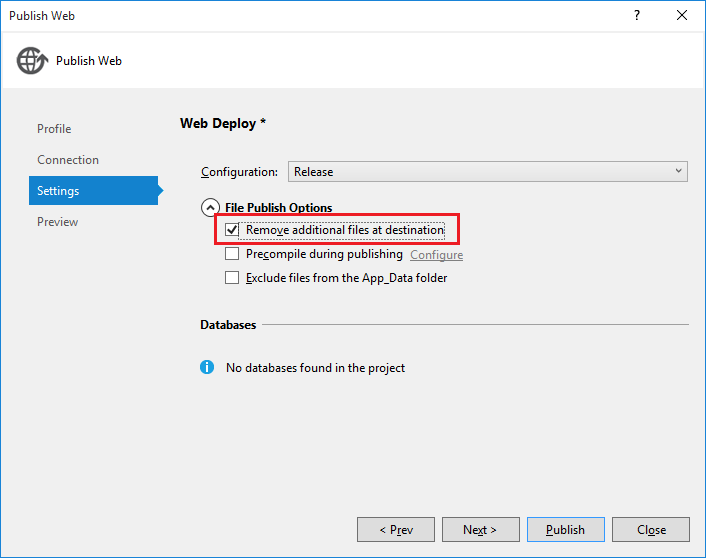
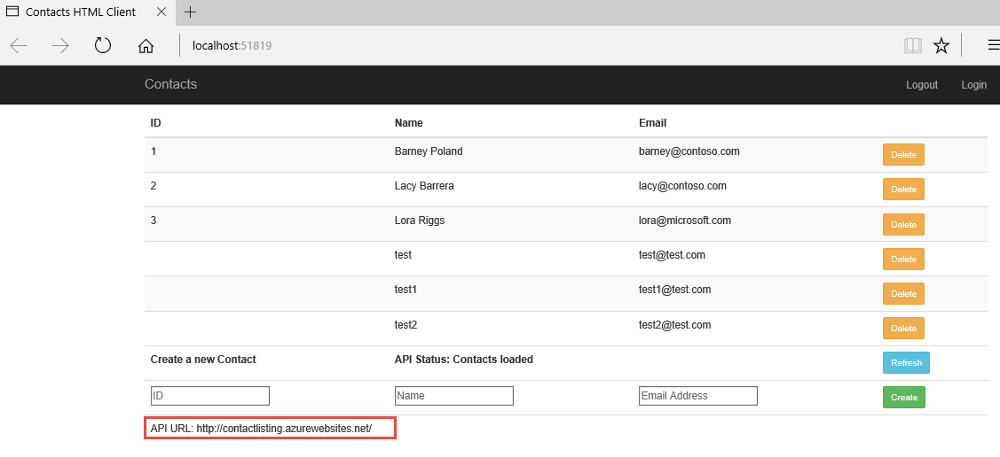

Create an app with a mobile and web client in Azure App Service
=======================================================================================
Mobile Apps in Azure App Service offer a highly scalable, globally available mobile application development platform for Enterprise Developers and System Integrators that brings a rich set of capabilities to mobile apps.

Mobile Apps help you build native and cross platform apps, connect to your enterprise systems, connect to SaaS APIs easily, build offline-ready apps with sync and push Notifications to millions in seconds.

In this lab, you create an App Service API app, deploy an ASP.NET Web API to the API app, and consume the API app from an AngularJS Web client.

This lab includes the following tasks:

* [Create a App Service Mobile App Portal](#create-a-app-service-mobile-app-portal)
* [Overview of the Sample application] (#overview-of-the-sample-application)
* [Publish a ContactList Web Api](#publish-a-ContactList-web-api)
* [Publish a ContactList web client UI](#publish-a-ContactList-web-client-ui)

## Create a App Service Mobile App in Portal

In this section, you will create a Azure App Service Mobile App backend.

1. Log into the [Azure Portal](https://portal.azure.com/). In the top left the window, click **+NEW**.

2. Click **Web + Mobile** and then click **Mobile App**.

3. Enter a unique **App Service Name**. Select **Subscription**. Create a new **Resource group** named contactlisting. **Resource Group**. Create a new **App Service Plan** in the region you want to run the lab in.

   <!--  -->

4. Click **Create**.

## Overview of the Sample application

The code that you'll deploy to an API app and a web app for this lab is in the Azure-Samples/app-service-api-dotnet-contact-list GitHub repository. The ContactsList Visual Studio solution includes the following projects used in this lab:

ContactsList.API - An ASP.NET Web API project that returns a list of names and email addresses. The initial call to the Get method returns 3 hard-coded contacts, then subsequent calls to Put, Post, and Delete methods save changes in a local JSON file.

ContactsList.Angular - An AngularJS client, for demonstrating CORS support.

1. Download the sample application

2. You can Download a .zip file or clone the repository on your local machine.

3. Open the ContactsList solution in Visual Studio 2015 or 2013.

4. Build the solution to restore the NuGet packages.

### Use Swagger metadata and UI

In this section of the lab you take a look at the generated Swagger 2.0 metadata, and then you try out a test UI that is based on the Swagger metadata.

1. Set the ContactsList.API project as the startup project.

2. Press F5 to run the project in debug mode.

	The browser opens and shows the 403 Forbidden page.

   <!--  -->

3. In your browser address bar, add swagger/docs/v1 to the end of the line, and then press Return. (The URL will be http://localhost:{port-num}/swagger/docs/v1.)

4. This is the default URL used by Swashbuckle to return Swagger 2.0 JSON metadata for the API. If you're using Internet Explorer, the browser prompts you to download a v1.json file.

	If you're using Chrome or Edge, the browser displays the JSON in the browser window.

5. In your browser address bar, add swagger to the end of the line, and then press Return. (The URL will be http://localhost:{port-num}/swagger.)

6. When the Swagger UI page appears, click Contacts to see the methods available.

   <!--  -->

## Publish a ContactList Web Api

In this section you use Azure tools that are integrated into the Visual Studio Publish Web wizard to create a new API app in Azure. Then you deploy the ContactsList.API project to the new API app and call the API by running the Swagger UI again, this time while it runs in the cloud.

1. In Solution Explorer, right-click the ContactsList.API project, and then click Publish.

2. In the Profile step of the Publish Web wizard, click Microsoft Azure App Service.

   <!--  -->

3. In the dialog box, Select Existing Web App. Select the App Service which was created for Web API and Click **OK** which will donwload the publish profiles of the particular web app and click on **Publish**.

   <!--  -->

4. Once the application is created, Add "swagger" to the URL in the browser's address bar, and then press Enter. (The URL will be http://{apiappname}.azurewebsites.net/swagger.)

	The browser displays the same Swagger UI that you saw earlier, but it is now running in the cloud. Try out the Get method, and you see that you're back to the default 3 contacts, because the changes you made earlier were saved in a local file; any changes you make now will be saved in the file system of the Azure API app.

5. Click **Browse** > **API Apps** > **{your new API app}**.

6. Click **Settings**, and then in the Settings blade find the API section and click API Definition.

   <!--  -->

   >The API Definition blade lets you specify the URL that returns Swagger 2.0 metadata in JSON format. When Visual Studio creates the API app, it sets the API definition URL to the default value that you saw earlier, which is the API app's base URL plus /swagger/docs/v1.

## Publish a ContactList Web Client UI

This lab shows how to consume an API app from JavaScript code in a website that is served from a different domain than the API app. The sample client uses AngularJS.

In the ContactsList sample application, the ContactsList.Angular project is a simple AngularJS client for the ContactsList.API Web API project.

1. In Visual Studio, open the project **ContactsList.Angular** > **_index.html_**.

        angular.module('myApp', []).controller('contactListCtrl', function ($scope, $http) {
        $scope.baseUrl = 'http://localhost:51864';

	The AngularJS JavaScript code that calls the API is in the index.html file in the ContactsList.Angular project. The code defines the functions and adds them to the $scope object, as shown here where the API's Get method is defined as $scope.refresh()

2. Run the AngularJS project locally:

	The code calls $scope.refresh() method when the page loads (at the end of of the snippet shown above) and is wired up to the Refresh button in the UI.

	>Note: These instructions work for Internet Explorer and Edge browsers because these browsers allow cross-origin JavaScript calls from and to http://localhost URLs. If you're using Chrome, start the browser with the --disable-web-security switch. If you're using Firefox, skip this section.

3. Set the ContactsList.API and ContactsList.Angular projects as startup projects, with ContactsList.API starting before ContactsList.Angular by right clicking on the Solution, opening the properties, and set both projects to Start.

   <!--  -->

4. Press F5 to start the projects.

5. The AngularJS UI displays the contacts that are stored locally, and you can use the UI to add and delete contacts.

6. Change the AngularJS project to point to the Azure API app. In the ContactsList.Angular project, open index.html.

	Comment out the line that sets baseUrl to the localhost URL, uncomment the line that sets baseUrl to an azurewebsites.net URL, and replace the placeholder with the actual name of the API app you created earlier. If you named the API app ContactsListAPI, the code now looks like the following example.

		$scope.baseUrl = 'https://ContactsListAPI.azurewebsites.net';
		//$scope.baseUrl = 'http://localhost:51864';

### Deploy the ContactsList.Angular project to the web app

1. Before the solution will work when running against Azure you must enable CORS on the API App.

2. Open the API App that you created earlier in the Azure Management Portal, within SETTINGS click CORS.

4. In the ALLOWED ORIGINS section add * and click Save on the toolbar.

  <!--  -->

5. In Solution Explorer, right-click the ContactsList.Angular project, and then click Publish.

6. Click the Microsoft Azure web App. Create a new Web App with the final app url along with the app settings like Subscription, Resource Group, App Service Plan and click Create which will create a Web App and download the deployment settings details

7. Click the Settings tab.

8. Expand File Publish Options, and then select Remove additional files at destination.

   <!--  -->

	Normally when you deploy a web project to an existing App Service web app you don't want the "remove additional files" option because any changes are typically updates or new files. In this case you're deploying a different project to the same web app, so there are likely to be many files from the earlier deployment that aren't needed in the new one.

9. Click Publish.

## Test the Mobile and Web Apps

1. Refresh the local client now that it has been updated to point to the API in Azure.

   <!--  -->

##Summary

By completing this lab you have learned how to:

* Create an Azure App Service API backend
* Use the same underlying API App for a web app
